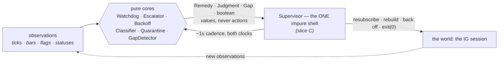
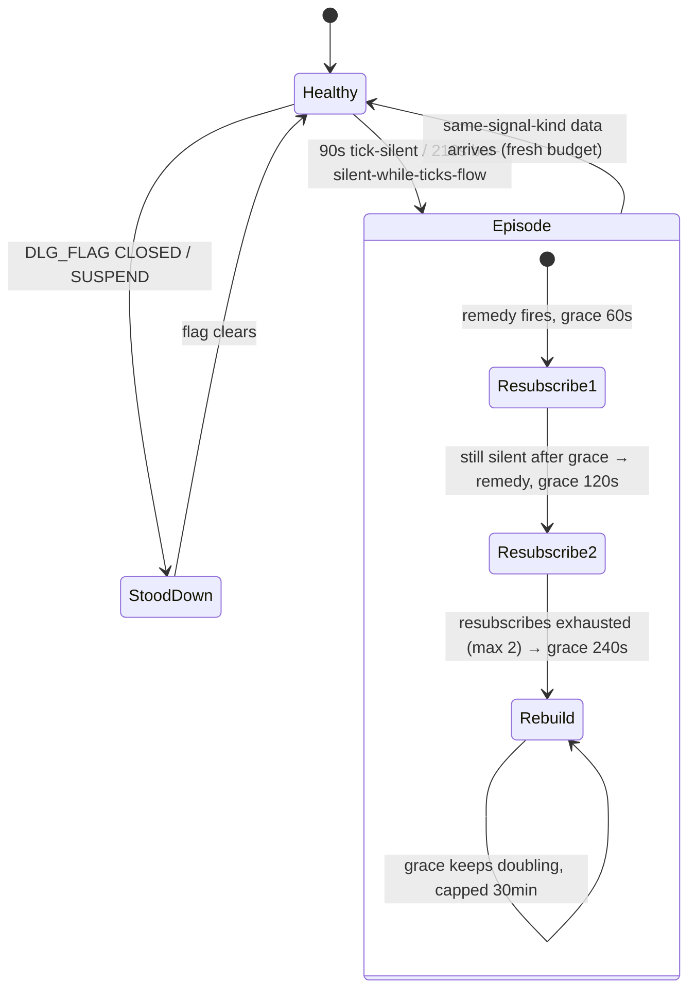

# Chapter 8 — The resilience belt: pure cores, one impure shell

Part of the Tradebench book. T5's supervision layer exists because the prototype ran
long enough, unattended enough, to collect real outages — and every class in
`market-data-service/.../supervise/` and `.../coverage/` is a specific incident with a
name. This chapter explains the pattern they share, then tours each core.

## The jargon

- **Pure core / impure shell** (a.k.a. *functional core, imperative shell*) — decision
  logic that only computes **values** (no I/O, no threads, no real clocks), wrapped by
  one thin component that owns all the effects.
- **Remedy / verdict / judgment** — the value a core returns: *what should be done*, not
  the doing of it.
- **Episode** — one continuous run of a problem, tracked so repeated evaluations don't
  re-punish the same incident every second.
- **Storm guard** — anything that stops a remedy firing repeatedly for one ongoing cause.
- **Backoff with jitter** — retry delays that grow exponentially and are randomised so a
  fleet of clients doesn't retry in lockstep (the *thundering herd*).

## The concept

A supervisor's logic is the hardest kind to test naively: it is *about* time, sockets,
and failure. Written conventionally — timers firing callbacks that call reconnect inside
themselves — you can only test it with real sleeps and fake sockets, so you barely test
it at all, and 3am is when you learn what it actually does.

The belt inverts that. Every decision lives in a class whose inputs are observations plus
a `long` clock reading, and whose output is a value:

Consequences: the §3.4 scenario scripts run as millisecond unit tests (the
`StalenessWatchdogTest.runTo()` harness replays whole outages as loops over seconds);
every test is deterministic; and the shell becomes so thin it is mostly a switch
statement — the only part left that *can't* be unit-tested is the part with almost no
logic in it. This echoes the platform-wide rule that business logic runs on in-memory
state with the DB downstream — here, decisions run on in-memory state with the *world*
downstream.

## Our code path — the tour

**`Tuning`** — every load-bearing number from playbook §8 in one record, built via
`Tuning.playbook()`. These are *policy constants proven against live incidents*, not
machine config (the T5 nod ruled code defaults deliberate here). The compact constructor
enforces the one cross-parameter invariant: `willRetryRebuild ≤ tryingRecoveryRebuild` —
an abandoned recovery must never be tolerated longer than an in-progress one.

**`StalenessWatchdog`** — §3.4 ported whole: *a connected socket is not a live feed*;
data freshness is truth, connection status is hearsay. Per market, two signals:

- `TICK_SILENT` — no tick for 90s. Exact and unambiguous: in-window DAX prints ~90/min.
- `BAR_SILENT_TICKS_FLOWING` — ticks arriving but no sealed bar for 210s. This is the
  **only** way to see a dead CHART subscription while PRICE lives, because bar-silence
  alone proves nothing (a quiet minute legitimately has no bar); the combination convicts.
  When both are silent, tick-silence wins (`staleSignal` checks it first) — a dead feed
  must not be misread as a dead chart.

Around the signals, four pieces of judgment, each visible in the code:

- *Stand-down by the market's own flag*: `DLG_FLAG` values `CLOSED`/`SUSPEND` suppress
  (`SUPPRESSING_FLAGS`) — weekends need no calendar and no hours config. Unknown flags
  deliberately do **not** suppress: a spurious resubscribe on a closed market is
  harmless, and its snapshot teaches us the real flag.
- *Episodes with doubling grace* (`remedyFor`): first remedy at the threshold, then grace
  60s → 120s → 240s → … capped at 30min; two resubscribes, then escalate to `REBUILD`. A
  genuinely-quiet-but-open market decays to about one remedy per half hour — never a
  storm. Healing (`healIf`) is **same-signal-kind only**: flowing ticks must never reset
  a dead-CHART episode, or the failure mode this signal exists for becomes undetectable.
- *Session-shaped verdict*: ≥2 markets stale together is never market noise — one
  `REBUILD`, not N remedies. It carries its own doubling grace
  (`lastSessionVerdict`/`sessionGraceNanos`), added after the test harness caught the
  verdict re-firing every round.
- *Clock-anomaly immunity*: chapter 7's discriminator; anomalous rounds re-baseline every
  stopwatch and return nothing. The contract is a **~1s evaluation cadence** — the freeze
  detector *defines* coarser jumps as anomalies, which is why the tests advance
  second-by-second.

A market's episode, as a state machine:

**`StuckSubstateEscalator`** — the 2h56m scar (§3.3): the SDK hung in
`DISCONNECTED:WILL-RETRY`, which trips no disconnect handler — it had given up without
saying so. The escalator times the substate on the monotonic clock and declares
`rebuildDue` past a threshold — **120s for WILL-RETRY, 300s for TRYING-RECOVERY**. The
asymmetry is informed patience: in TRYING-RECOVERY the server may still complete a
*lossless replay*, so waiting can win back data; in WILL-RETRY the server has abandoned
recovery, so every waited second is pure loss. One subtle line: `onStatus` only restarts
the stopwatch when the substate *changes* — a chattily re-fired identical status must not
launder the elapsed time.

**`BackoffPolicy`** — `base·2^(attempt−1)`, jittered ±50% (injectable `DoubleSupplier`,
so tests are exact), capped at 60s — then the part IG taught us: a **5s floor on every
rebuild, including the first**, because rapid re-logins hit IG's response cache and come
back with stale tokens; being slower here is being correct. And nothing retries forever:
`exhausted` at 10 consecutive failures → the Supervisor exits **0**, cleanly — a
deliberate stop with a written record, not a crash loop hammering a broker at 3am.

**`ReconnectClassifier`** — after streaming resumes, the only operational question: *did
we lose data?* Lightstreamer's contract makes it answerable: if the outage contained a
`WILL-RETRY` sighting, the server discarded its replay buffer → **replaced**, data is
gone, a heal is owed; no sighting → **replayed**, no gap. The returned `Reconnect` value
carries `wallOutage`, `awakeOutage`, and `hostSleptDuring` (the 16-minute lid-close that
once logged as "0.4s offline"). Two more notes from `noteFor`: `CONNECTED:HTTP-POLLING`
is flagged — a silent WebSocket→polling downgrade degrades latency and often precedes a
drop — and an intentional `close()` sets `closing` so the farewell `DISCONNECTED` is
hushed. That last one guards a principle, not a log line: **quiet must stay meaningful**
(P9's inverse — if routine shutdowns print scare-lines, real ones stop being read).

**`WitnessQuarantine`** — §3.5's blast-radius rule for the multi-market future, built now
so N=1 is the degenerate case rather than a rewrite. The inference: a subscription
failing its third strike *while another market's PRICE+CHART pair is fully confirmed*
means the session is provably fine and the epic is the only differing variable →
market-shaped → `Quarantine` just it. No witness → session-shaped → `Rebuild`. The middle
case is the craft: a would-be witness still inside its 30s confirm window returns `Wait`
(and un-counts the strike) — never race a fast rejection into a whole-service rebuild.
Strikes are per-session attempt counts, so a flapping error code can't reset them;
quarantine exit is **restart-only** (config-shaped failures don't self-heal); a refused
unsubscribe always rebuilds (it would double-deliver every update). At N=1 the structure
guarantees the last market dies loud, never quarantined into a silently idle service.

**`coverage.GapDetector`** — sealed bars land on a minute grid, so coverage is checkable
*online*: per epic, a watermark of the latest bar start; a bar landing more than one
minute past it names the hole — `missing = minutesBetween − 1` (the bars at both ends
exist). Two guards, both from live behaviour: IG re-sends completed candles, so
duplicates (`compareTo ≤ 0`) return null; and a *late redelivery of an older bar* can
never regress the watermark and conjure a phantom gap. Gaps are **information, not
errors** — facts T6's heal consumes. The Sunday 17:00–17:15 outage is pinned literally:
`theLiveOutageSpecimenIsNamedExactly` asserts bars at 17:02 then 17:15 yield
`Gap(17:03, 17:14, 12)`.

## What slices B and C wire in

Slice A built the judgment; it is not yet in the running process. **B** gives verdicts a
durable voice: `store.EventLog` writing the reliability vocabulary into
`service_events`, Flyway V2's `bar_gaps` table (with `healed_at` for T6), GapDetector
feeding it. **C** builds the one impure shell: `Supervisor` (owns the stream lifecycle,
runs the ~1s cadence, executes remedies via resubscribe / `IgSessionManager.afterFailure`
rebuilds under `BackoffPolicy`, exits 0 on exhaustion), `HealthProbe` (a `StreamEvents`
decorator noting arrivals for the watchdog), `Main` rewired so streaming lives under
supervision, and the heartbeat extended with per-market staleness ages.

## The scars, in one line each

Silent-while-connected (2h56m) → the escalator and the watchdog's worldview. The remedy
storm risk → episodes, doubling grace, the session guard. IG's login cache → the backoff
floor. "0.4s offline" → dual-duration reporting. The 17:00 Sunday outage → GapDetector's
literal test fixture. None of these numbers are guesses; that is why they live in
`Tuning.playbook()` under version control rather than in anyone's memory.

*Previous: [Chapter 7 — Clocks](07-clocks-wall-monotonic-and-sleep.md) ·
[Book index](README.md) · Next: [Chapter 9 — Busses and serving data
outward](09-busses-and-serving-data-outward.md)*
