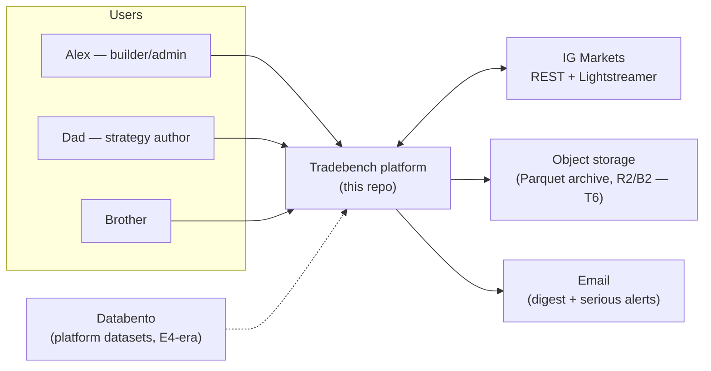
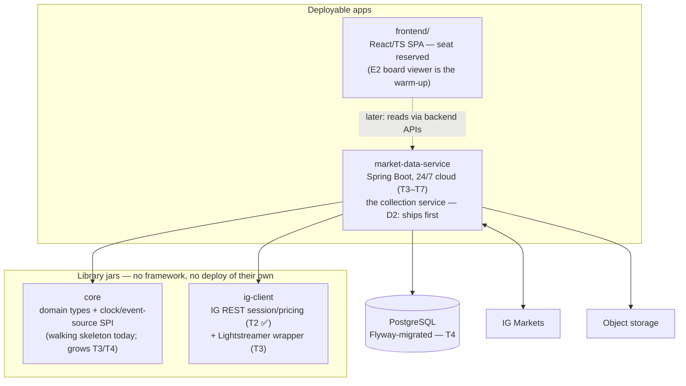
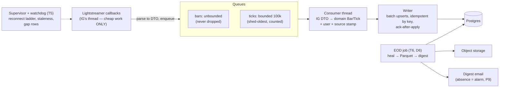
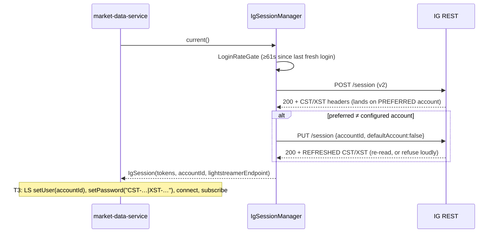

# Tradebench Architecture

> **What this is.** The living architecture document — context → containers (deployables) →
> components (per module) → key behaviours, C4-style. It describes **what exists now** and
> the **E1 target shape** it is growing into; horizon epics (E4+) appear only as reserved
> seats. **Keep-current duty:** update this doc at the close-out of any ticket that changes
> the system's shape (new module, new deployable, new boundary, changed dataflow). Rulings
> trace to `docs/decisions.md`; deep design history to `docs/design-sessions/`.
>
> Status: v1, 2026-09-27 — reflects E1-T1 (merged) + E1-T2 (PR #2).

## 1. Context — who and what Tradebench talks to

The platform is provider-agnostic (D5): IG is the first integration, never the identity.
Every series knows its source; user + data-source are first-class dimensions in every
schema/API from day one (the platform runs as `default-user` until login lands, PRD §2).

## 2. Containers — deployables and the artifacts they're built from

**Dependency rules (enforced from commit 1, build plan §2):** `core` and `ig-client` depend
on **nothing of ours**; apps depend on libraries, never sideways on other apps; `ig-client`
stays **framework-free** (its consumers include the future OMS, the simulator's contract
tests, and throwaway CLIs — none should drag Spring in). Reserved module seats for later
epics: `indicator-lib`, `strategy-dsl`, `engine`, `execution-oms`, `ig-simulator`,
`backtester`, `workbench`.

**Runtime posture (T7):** one `docker compose` stack (service + `postgres:16` + nightly
`pg_dump` → object storage) on a small cloud box; staging + prod with separate DBs, promoted
by release tag; outbound-only network (IG + heartbeat); Linux containers only, never Windows.

## 3. Components

### 3.1 `ig-client` (state: T2 — session + REST core in PR #2)

| Package | Components | Responsibility |
|---|---|---|
| root | `IgEnvironment`, `IgCredentials` | one flag picks env (base URL + credential prefix); env-var loading fails naming the missing key; regexes enforced; secrets masked in `toString` |
| `error` | `IgErrorClass`, `IgErrorClassifier`, `IgErrors`, exceptions | the §1.6 taxonomy: FATAL_CONFIG (stop — lockout risk) vs RETRYABLE (rebuild fixes); session-dead is a **context** handled by the session manager, not an enum value |
| `http` | `HttpCall`, `HttpResult`, **`HttpTransport`**, `JdkHttpTransport` | **the wire seam** — the app injects the transport and may decorate it (retries, circuit breaker); timeouts injectable, library defaults 10s/30s |
| `session` | `IgSessionManager`, `LoginRateGate`, `IgSession`, `IgTokens`, `IgAccount` | login → switch → token re-read (§1.1); validate-before-relogin (§1.2); 61s stagger on monotonic clock |
| `rest` | `IgRestClient`, `RequestPacer`, price/market records | paced (30/min) REST v3: market details + dealing rules; prices last-N keyed on `snapshotTimeUTC` only, allowance parsed |
| `time` | `Sleeper` | injectable sleep seam; monotonic time enters as `LongSupplier` |
| *(T3)* | `ig.stream` | Lightstreamer wrapper: PRICE + CHART:1MINUTE (`CONS_END=1` only), cheap-parse-then-queue, status stream for the supervisor |

**Resilience split (settled with Alex, 2026-09-27):** *IG-semantic mechanism* lives in this
library (pacing, login stagger, taxonomy, dead-socket retry-once later) because every caller
needs it to stay inside IG's rules; *policy* (backoff ladders, retry ceilings, circuit
breaking) lives in the consuming service — T5's supervisor is the domain-tuned circuit
breaker, and generic breakers compose as `HttpTransport` decorators without library changes.

### 3.2 `core` (state: walking skeleton; grows with T3/T4)

Planned seats (build plan §4): `core.domain` — `Bar`/`Tick` value types on `BigDecimal`,
instrument identity, trading calendar; `core.time` — Clock SPI (monotonic + wall,
injectable); `core.events` — EventSource SPI (ticks/bars as one ordered stream — the seam
live/replay/fast-forward all implement; "one engine, many clocks").

### 3.3 `market-data-service` (state: walking skeleton; the E1 flesh)

The pipeline (T3→T6), with the **anti-corruption boundary** at its entry: an adapter maps
IG-shaped DTOs to `core` domain types, stamping **user + source** exactly once — nothing
downstream ever sees an IG shape.

Startup takes the single-instance **advisory lock** before any IG contact (no persistence ⇒
do not run). The DB is downstream of decisions, never upstream (golden rule 4).

## 4. Key behaviours

### 4.1 Session bring-up (implemented, T2)

After any failure: `afterFailure()` → cheap `GET /session` validation → reuse if alive;
fresh login only when tokens are genuinely dead (IG's login cache serves stale tokens to
rapid re-logins). Fatal-config errors stop immediately — no retry storms into a key lockout.

### 4.2 Failure & recovery ladder (T5 target, playbook §3)

Transient blips → Lightstreamer auto-reconnect (observed only) → supervisor rebuild with
backoff (`1.0·2^(n-1)` ±50% jitter, cap 60s, floor 5s, 10-failure clean stop) →
stuck-substate escalation (WILL-RETRY 120s / TRYING-RECOVERY 300s, monotonic clock) →
staleness watchdog (tick-silent 90s; bar-silent-while-ticks-flow 210s; market state from the
stream's `DLG_FLAG`, no calendar) → witness-rule quarantine when multi-market. All pure
logic on injectable clocks returning *values* the service executes.

### 4.3 Daily completeness cycle (T6 target, D6)

`@Scheduled` end-of-day: scan-first gap detection (anti-join, contiguous runs) → REST v3
heal, window-clipped and allowance-aware (ticks are stream-only, never "healed") → day's
Parquet to object storage → digest email. An audited `job_runs` row every run, clean or not
— **the absence of the digest is itself the alarm** (P9).

## 5. Frontend (shape reserved)

React/TS SPA in `frontend/`, own toolchain (D3); backend does the work, streams data to a
thin visual client (PRD §10). First real resident: the **E2 board viewer** (D11 — markdown
stays the write model; the app renders the read model). Component/state/dataflow
documentation gets its own section here when E2 planning cuts tickets — same keep-current
duty as the backend.

## 6. Cross-cutting rules

- **Injectable clocks everywhere**; monotonic (`nanoTime`-style) vs wall time explicitly
  split — the sleep/freeze discriminators depend on comparing them.
- **UTC in storage, always**; local wall-clock window conversions happen in code at
  check-time, never in config or stored data.
- **Exact decimals** (`BigDecimal`, wire scale preserved) through the whole data path (D36).
- **User + source dimensions** stamped at every system boundary.
- **Fail closed, fail loud** (P9): missing config names the key and stops; ambiguous wire
  data is refused, never guessed; quiet is healthy, silence where noise is expected is an
  alarm.
