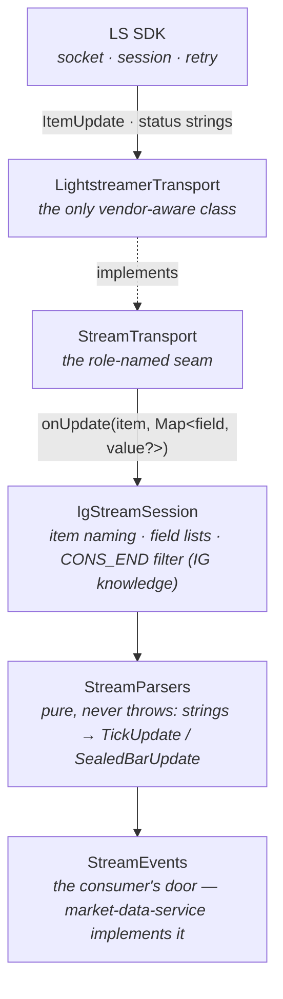

# Chapter 1 — Sockets and Lightstreamer

How a price in Frankfurt becomes a method call on your machine.

## The jargon

- **TCP socket** — a long-lived, ordered, reliable byte pipe between two machines. Everything
  below is framing on top of this pipe.
- **HTTP** — request/response on top of TCP: the client asks, the server answers, done. Great
  for "give me yesterday's bars", terrible for "tell me every time the price moves".
- **Polling** — faking a live feed over HTTP by asking repeatedly. Latency = your poll
  interval; cost = mostly-empty responses.
- **Push / streaming** — the server initiates: one connection stays open and the server writes
  events down it the moment they happen.
- **WebSocket** — the standard way to get a push-capable pipe through the HTTP world: starts
  as an HTTP request, then "upgrades" the same TCP socket into a free-form two-way channel.
- **Lightstreamer (LS)** — a commercial push server (and client SDK) IG runs in front of its
  price engine. It manages the WebSocket, falls back to HTTP long-polling when networks
  misbehave, batches updates, and resumes sessions after drops.

## The concept

A market data feed is the canonical push problem: events are frequent, unpredictable, and
stale the moment they age. Lightstreamer's model has four nouns:

- **Session** — one authenticated connection to the LS server. It has a lifecycle announced
  through status strings (`CONNECTING`, `CONNECTED:WS-STREAMING`, `DISCONNECTED:WILL-RETRY`, …)
  that chapter 8 turns into supervision decisions.
- **Item** — a named thing you can subscribe to, e.g. `CHART:IX.D.DAX.DAILY.IP:1MINUTE`.
- **Fields** — named values on an item (`BIDPRICE1`, `UTM`, …). You subscribe to an item *and*
  a field list; you get only what you asked for.
- **Subscription mode** — the delivery contract per item:
  - `MERGE`: the item is a row of current values. You get a snapshot, then **deltas — updates
    carry only the fields that changed**. Right for "the current price".
  - `DISTINCT`: every update is a discrete event, delivered whole. Right for "each order
    confirmation" (IG's `TRADE:{accountId}` stream — OMS-era, not ours yet).

That MERGE delta rule is the single most important mechanical fact in this chapter — it
resurfaces twice below.

## IG's specifics

IG wires authentication oddly (playbook §1.1, §1.3): you never give LS your API key. The REST
login response hands back two tokens (`CST`, `X-SECURITY-TOKEN`) and a per-session
`lightstreamerEndpoint`. The LS credentials are then: **user = the active account id,
password = `CST-…|XST-…`** — the tokens glued together. `IgStreamClient.connect`
(`ig-client/src/main/java/dev/amfshr/tradebench/ig/stream/IgStreamClient.java`) does exactly
this wiring from an `IgSession`, endpoint from the login response, never hardcoded.

Per market we run **two subscriptions** (playbook §2.1), both `MERGE`:

| Capability | Item | Fields | Quirk |
|---|---|---|---|
| `subscribePrice` (ticks) | `PRICE:{accountId}:{epic}` | `TIMESTAMP, BIDPRICE1, ASKPRICE1, DLG_FLAG` | account-scoped item — the §1.1 wrong-account trap: authenticate as the wrong account and you get silence, not an error. Needs the explicit `Pricing` data adapter. |
| `subscribeChart1m` (bars) | `CHART:{epic}:1MINUTE` | `UTM, CONS_END, BID_/OFR_ OHLC, LTV` | **no** data adapter — demo/live expose only the default; setting one fails. |

They are separate methods on `IgStreamSession` on purpose: which to combine is the
*consumer's* policy. The market-data-service pairs them per market (ticks for precision,
broker bars for the healable record — D15); a future OMS consumer would make different
choices. The client stays dumb.

### The three-state candle and `CONS_END`

The CHART stream is not "a bar per minute". It pushes the **forming candle continuously** —
open set, high/low/close mutating with every trade — and then one final update where
`CONS_END == "1"`: the seal. `IgStreamSession.subscribeChart1m` filters right there in the
callback: no `CONS_END` field → malformed; `CONS_END != "1"` → silently discard the partial;
`"1"` → parse and deliver. Persisting partials silently corrupts your bars (playbook §2.2) —
this filter is the whole reason our `bars_1m` table can claim every row is a sealed truth.
(The forming candle isn't useless — it's how the DSL's `[0]` forming-bar semantics get fed
in the E3 era, per D9 — but *capture* stores atoms, and the atom is the sealed bar.)

### The MERGE delta trap

Because PRICE/CHART are MERGE, a raw `ItemUpdate` may carry only the changed fields — a tick
where only the bid moved has no `ASKPRICE1` in the delta. Parse the delta naively and you'd
drop half your ticks as "malformed". The defusal is one deliberate line:
`LightstreamerTransport.extractFields` rebuilds the map by calling **`update.getValue(field)`
for every subscribed field** — the SDK answers with the *current merged value*, changed or
not. `LightstreamerTransportTest.extractsTheSubscribedFieldsFromAnItemUpdate` pins it. An
outside review later independently derived this exact trap; the adapter was built for it.

## Our code path

- `StreamTransport` (`…/ig/stream/StreamTransport.java`) is the seam: `connect` → `Connection`
  → `subscribe(SubscriptionSpec, UpdateListener, StateListener)`. The nested interfaces are a
  contract family (`Flow`/`Map.Entry` precedent — tech-notes nesting rule): meaningless apart,
  named together. Everything above this line tests on fakes.
- `LightstreamerTransport` is *the only class in the repo that touches the LS SDK* — role-named
  interface, vendor-named implementation (same pattern as `HttpTransport`/`JdkHttpTransport`).
  Swapping streaming vendors means writing one class.
- Testing the vendor edge without a server: `ItemUpdate` is an SDK interface, so
  `LightstreamerTransportTest.fakeItemUpdate` builds one with `java.lang.reflect.Proxy` — a
  dynamic implementation answering only `getItemName`/`getValue` and throwing on anything
  else, so if the transport ever starts calling new SDK surface, the test says so.
- `StreamParsers` (`…/ig/stream/StreamParsers.java`) is the pure boundary: field map in, value
  out, **never throws, never blocks** — malformed input yields `null` and the caller counts
  it. Why that contract matters is chapter 2's whole subject. Two wire facts live here:
  timestamps (`TIMESTAMP`, `UTM`) are **epoch milliseconds as strings**, and the wire pads
  `DLG_FLAG` with trailing spaces (`"DEAL "`) — stripped at parse, per playbook §2.2.
- Prices parse as `BigDecimal`, never double — a price is an exact decimal, and the golden
  fixtures assert scale survives the trip (tech-notes; the same doctrine as REST's
  `requireDecimal`).

## The scars

- **The preferred-account trap** (playbook §1.1): stream as the wrong account and PRICE items
  yield *nothing* — no error, just silence. That silence-is-failure experience shaped the
  whole resilience design: chapter 8's watchdog trusts data freshness, never connection state.
- **Partial candles persisted as bars** — the prototype era learned `CONS_END` the hard way;
  our filter sits in the one place partials can't leak past.
- **`MARKET:{epic}` no longer exists** (decommissioned May 2026, playbook §2.3): market state
  must be derived from `DLG_FLAG` on the tick stream. That's why the flag is a first-class
  field here and becomes state machinery in chapter 3.
- **No native higher timeframes** (playbook §2.3): CHART scales stop at `HOUR` and skip
  2/3/10/15-minute entirely. Every higher timeframe is aggregated from healed 1m in our own
  code (D15) — the stream can't do it for you.

*Previous: [Field Manual index](README.md) · Next: [Chapter 2 — Threads and the callback boundary](02-threads-and-the-callback-boundary.md)*
