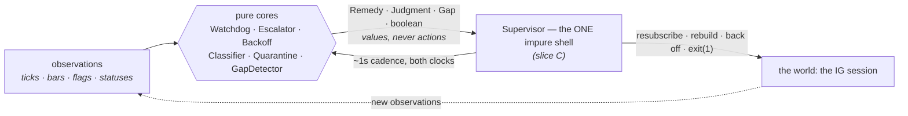
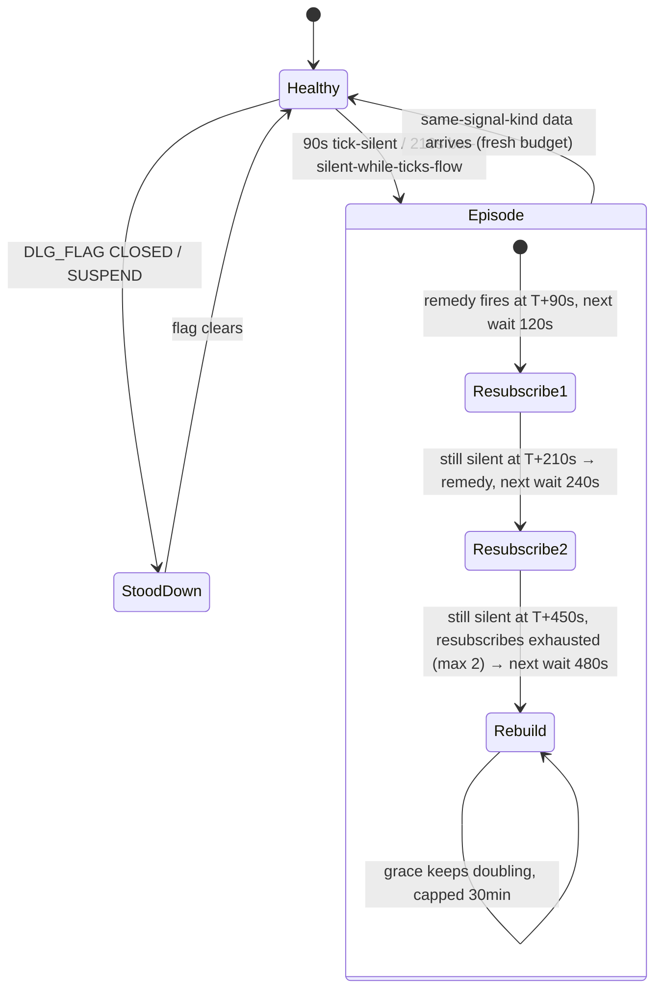

# Chapter 8 — The resilience belt: pure cores, one impure shell

Part of the Tradebench Field Manual. T5's supervision layer exists because the prototype ran
long enough, unattended enough, to collect real outages — and every class in
`market-data-service/.../supervise/` and `.../coverage/` is a specific incident with a
name. This chapter explains the pattern they share, tours each core, then follows the
`Supervisor` shell (slice C) that composes them into a running service. Chapter 10 is its
companion read the other way round — the **failure playbook**: what breaks, what we do, what it
costs, and the rulings behind every number used here.

## The jargon

- **Pure core / impure shell** (a.k.a. *functional core, imperative shell*) — decision
  logic that only computes **values** (no I/O, no threads, no real clocks), wrapped by
  one thin component that owns all the effects.
- **Remedy / verdict / judgment** — the value a core returns: *what should be done*, not
  the doing of it.
- **Episode** — one continuous run of a problem, tracked so repeated evaluations don't
  re-punish the same incident every second.
- **Storm guard** — anything that stops a remedy firing repeatedly for one ongoing cause.
- **Backoff with jitter** — retry delays that grow exponentially and are randomised so a
  fleet of clients doesn't retry in lockstep (the *thundering herd*).

## The concept

A supervisor's logic is the hardest kind to test naively: it is *about* time, sockets,
and failure. Written conventionally — timers firing callbacks that call reconnect inside
themselves — you can only test it with real sleeps and fake sockets, so you barely test
it at all, and 3am is when you learn what it actually does.

The belt inverts that. Every decision lives in a class whose inputs are observations plus
a `long` clock reading, and whose output is a value:



Consequences: the §3.4 scenario scripts run as millisecond unit tests (the
`StalenessWatchdogTest.runTo()` harness replays whole outages as loops over seconds);
every test is deterministic; and the shell becomes so thin it is mostly a switch
statement — the only part left that *can't* be unit-tested is the part with almost no
logic in it. This echoes the platform-wide rule that business logic runs on in-memory
state with the DB downstream — here, decisions run on in-memory state with the *world*
downstream.

## Our code path — the tour

**`Tuning`** — every load-bearing number from playbook §8 in one record, built via
`Tuning.playbook()`. These are *policy constants proven against live incidents*, not
machine config (the T5 nod ruled code defaults deliberate here). The compact constructor
enforces the one cross-parameter invariant: `willRetryRebuild ≤ tryingRecoveryRebuild` —
an abandoned recovery must never be tolerated longer than an in-progress one.

**`StalenessWatchdog`** — §3.4 ported whole: *a connected socket is not a live feed*;
data freshness is truth, connection status is hearsay. Per market, two signals:

- `TICK_SILENT` — no tick for 90s. Exact and unambiguous: in-window DAX prints ~90/min.
- `BAR_SILENT_TICKS_FLOWING` — ticks arriving but no sealed bar for 210s. This is the
  **only** way to see a dead CHART subscription while PRICE lives, because bar-silence
  alone proves nothing (a quiet minute legitimately has no bar); the combination convicts.
  When both are silent, tick-silence wins (`staleSignal` checks it first) — a dead feed
  must not be misread as a dead chart.

Around the signals, four pieces of judgment, each visible in the code:

- *Stand-down by the market's own flag*: `DLG_FLAG` values `CLOSED`/`SUSPEND` suppress
  (`SUPPRESSING_FLAGS`) — weekends need no calendar and no hours config. Unknown flags
  deliberately do **not** suppress: a spurious resubscribe on a closed market is
  harmless, and its snapshot teaches us the real flag.
- *Episodes with doubling grace* (`remedyFor`): first remedy at the threshold (90s tick-silent);
  the grace then doubles **before** each wait — 120s, 240s, 480s … capped at 30min (the 60s base
  is the seed, never itself waited) — so the second resubscribe lands at T+210s and the
  escalation to `REBUILD` at T+450s (two resubscribes, then rebuild). A
  genuinely-quiet-but-open market decays to about one remedy per half hour — never a
  storm. Healing (`healIf`) is **same-signal-kind only**: flowing ticks must never reset
  a dead-CHART episode, or the failure mode this signal exists for becomes undetectable.
- *Session-shaped verdict*: ≥2 markets stale together is never market noise — one
  `REBUILD`, not N remedies. It carries its own doubling grace
  (`lastSessionVerdict`/`sessionGraceNanos`), added after the test harness caught the
  verdict re-firing every round.
- *Clock-anomaly immunity*: chapter 7's discriminator; anomalous rounds re-baseline every
  stopwatch and return nothing. The contract is a **~1s evaluation cadence** — the freeze
  detector *defines* coarser jumps as anomalies, which is why the tests advance
  second-by-second.

A market's episode, as a state machine:



**`StuckSubstateEscalator`** — the 2h56m scar (§3.3): the SDK hung in
`DISCONNECTED:WILL-RETRY`, which trips no disconnect handler — it had given up without
saying so. The escalator times the substate on the monotonic clock and declares
`rebuildDue` past a threshold — **120s for WILL-RETRY, 300s for TRYING-RECOVERY**. The
asymmetry is informed patience: in TRYING-RECOVERY the server may still complete a
*lossless replay*, so waiting can win back data; in WILL-RETRY the server has abandoned
recovery, so every waited second is pure loss. One subtle line: `onStatus` only restarts
the stopwatch when the substate *changes* — a chattily re-fired identical status must not
launder the elapsed time.

**`BackoffPolicy`** — `base·2^(attempt−1)`, jittered ±50% (injectable `DoubleSupplier`,
so tests are exact), capped at 60s — then the part IG taught us: a **5s floor on every
rebuild, including the first**, because rapid re-logins hit IG's response cache and come
back with stale tokens; being slower here is being correct. And nothing retries forever:
recovery is **budgeted** — `giveUpAfter`, 10 minutes of continuous no-streaming from an
outage's first rebuild (the 10-rebuild ceiling stays as a cap; rung cadence is set by the
detectors, so a full ten-rung ladder spans anywhere from 20 minutes to 3.5 hours depending
on which one drives it — which is why the budget is a clock, not a count) → the Supervisor gives up with `FEED_DEAD` and the runner exits **1** — a deliberate
stop with a written record, restarted by the process supervisor, not a crash loop hammering
a broker at 3am.

**`ReconnectClassifier`** — after streaming resumes, the only operational question: *did
we lose data?* Lightstreamer's contract makes it answerable: if the outage contained a
`WILL-RETRY` sighting, the server discarded its replay buffer → **replaced**, data is
gone, a heal is owed; no sighting → **replayed**, no gap. The returned `Reconnect` value
carries `wallOutage`, `awakeOutage`, and `hostSleptDuring` (the 16-minute lid-close that
once logged as "0.4s offline"). Two more notes from `noteFor`: `CONNECTED:HTTP-POLLING`
is flagged — a silent WebSocket→polling downgrade degrades latency and often precedes a
drop — and an intentional `close()` sets `closing` so the farewell `DISCONNECTED` is
hushed. That last one guards a principle, not a log line: **quiet must stay meaningful**
(P9's inverse — if routine shutdowns print scare-lines, real ones stop being read). And one
static rule beside `isStreaming`: `isTerminal` — a bare `DISCONNECTED`, the client having given up
for good (playbook §3.1), never the two retry substates the escalator paces. The Supervisor rebuilds
on it at once, backoff-paced, because nothing else can: no substate will escalate it, and the
watchdog stands down on closed markets (E1-T10 #2). The `onServerError` the SDK sends after it latches
the same death — one death, one rebuild, however many callbacks announce it — and because the
latch is asked again every sweep, a refusal that recurs inside the pacing floor climbs the ladder
like any other outage instead of stalling at one rung until the budget.

**`WitnessQuarantine`** — §3.5's blast-radius rule for the multi-market future, built now
so N=1 is the degenerate case rather than a rewrite. The inference: a subscription
failing its third strike *while another market's PRICE+CHART pair is fully confirmed*
means the session is provably fine and the epic is the only differing variable →
market-shaped → `Quarantine` just it. No witness → session-shaped → `Rebuild`. The middle
case is the craft: a would-be witness still inside its 30s confirm window returns `Wait`
(and un-counts the strike) — never race a fast rejection into a whole-service rebuild.
Strikes are per-session attempt counts, so a flapping error code can't reset them;
quarantine exit is **restart-only** (config-shaped failures don't self-heal); a refused
unsubscribe always rebuilds (it would double-deliver every update). At N=1 the structure
guarantees the last market dies loud, never quarantined into a silently idle service. Once quarantined, a market's further rejections
return `Ignored` — every market is two legs, and the pair's second rejection is already on the
queue when the verdict falls (E1-T10 #1); `IgStreamControl.resubscribe` refuses a quarantined epic
too, the second lock on the same door.

**`coverage.GapDetector`** — sealed bars land on a minute grid, so coverage is checkable
*online*: per epic, a watermark of the latest bar start; a bar landing more than one
minute past it names the hole — `missing = minutesBetween − 1` (the bars at both ends
exist). Two guards, both from live behaviour: IG re-sends completed candles, so
duplicates (`compareTo ≤ 0`) return null; and a *late redelivery of an older bar* can
never regress the watermark and conjure a phantom gap. Gaps are **information, not
errors** — facts T6's heal consumes. The Sunday 17:00–17:15 outage is pinned literally:
`theLiveOutageSpecimenIsNamedExactly` asserts bars at 17:02 then 17:15 yield
`Gap(17:03, 17:14, 12)`.

## The shell: the Supervisor

Slice A is pure judgment with nowhere to run; **slice C gives it a process.** `Supervisor`
is the *one impure shell* the title promises — it owns the threads, the clock readings, the
event writes, and the calls into the real session. Everything hard to test was pushed into
the cores; what is left here is composition and timing, and it is deliberately thin.

**Two threads, mirroring the pump.** A Lightstreamer connection calls back on its own
thread, and chapter 2's rule is absolute: *do only cheap work there*. So `onStatusChange` /
`onServerError` do exactly two things — read the clocks and drop an `Observation` onto a
`ConcurrentLinkedQueue` — then return. The real work runs on a dedicated
`capture-supervisor` thread whose `run()` loop is just `sweep(); sleeper.sleep(interval)` at
a ~1s cadence. That thread owns the cores, the `watched` set, and the `lastFed*` maps
*alone* — so the cores stay single-threaded and lock-free, exactly as the pump's consumer
owns its state. The queue is the one hand-off, and it is the happens-before fence: what the
callback thread wrote before `add()` is visible to the sweep thread after `poll()`
(chapter 3).

**Events and ticks do not share a queue.** This surprises people, so state it plainly.
There are *two* freshness paths, each shaped by its traffic:

- *Control observations* — status changes and server errors — are **pushed** onto the
  Supervisor's own control queue. They are rare (a handful a day) and each one matters, so
  none may be dropped.
- *Tick and bar freshness* is **pulled**, never queued. Ticks arrive ~90/min; the watchdog
  needs not each one but *the latest arrival time*. So `Buffers` stamps a last-seen monotonic
  clock on the LS callback thread (O(1)), and `checkStaleness()` reads it through the `MarketFreshness` seam each
  sweep. Pushing every tick through the control queue would be pointless traffic for a value
  the watchdog overwrites ninety times a minute.

That push/pull split is the whole reason the control queue stays tiny and the sweep stays
cheap — and it is why the ticks you see flowing in chapter 4 never appear in this chapter's
queue.

**The sweep.** One pass does three things, in order. First it drains the observation queue:
each `Status` feeds `ReconnectClassifier` and `StuckSubstateEscalator` (emitting a
`RECONNECT` or `TRANSPORT_DOWNGRADED` event when the classifier returns one); each
`ServerError` writes an `IG_API_ERROR`; a bare `DISCONNECTED` or a `ServerError` latches a death
(E1-T10 #2). Second, the recovery budget: if the first rebuild of
this outage was `giveUpAfter` ago and streaming never resumed, give up — checked here, after
the drain (a queued resume resets it first) and before any detector, so it never depends on
how often a detector re-fires. Third, the detectors — a latched death first (asked again every sweep until the pacing lets the
rebuild run, so a refusal that recurs inside the floor still climbs the ladder), then the
escalator if a rebuild is due, then `checkStaleness()`. Nothing blocks; the pass is microseconds of CPU. Event writes
are **best-effort here as in the pump**: a failing write is counted (`eventWriteFailures`,
surfaced by the heartbeat), never allowed to kill the sweep thread — observability is
downstream of the decision. **Every event named here is a `ServiceEvent` written through the
`EventLog` seam into
`service_events`** — slice B (merged, PR #11) gave the belt its durable voice, so the reason
a 3am rebuild happened is a row, not a lost log line; the catalogue is D25's `EventType`, the
schema lives in `docs/design/observability-and-data-model.md`.

**Feeding the watchdog only on advance.** This is the subtle line. `MarketFreshness`
returns a *fixed* value — the last arrival — and keeps returning it until a real new tick
moves it. The watchdog's `onTick` *heals* a staleness episode. So if the sweep fed that
last-seen value every second, a market that went silent at 14:00 would be "healed" at
14:00:01, :02, :03 … forever, and a dead feed would read as eternally healthy. The guard is
one comparison:

```java
long tick = freshness.lastTickMono(epic);
if (tick != Long.MIN_VALUE && tick != lastFedTick.get(epic)) {
    watchdog.onTick(epic, tick);  // only on ADVANCE — a replayed last-seen must not heal
    lastFedTick.put(epic, tick);
}
```

A *new* tick (the value changed) heals; a *frozen* last-seen (same as last sweep) is
ignored, and silence accrues as it should. The `aRealTickHealsThenRenewedSilence…` test pins
it: one real tick heals, then renewed quiet trips *exactly one* resubscribe — not zero
(healed forever), not many (re-fed each round).

The watchdog never reads a clock itself — the sweep hands it two `long`s, `monotonicNanos`
and `wallMillis`, every round. It measures staleness as *now − last-arrival* on the
**monotonic** clock (chapter 7: monotonic cannot jump when the wall clock is adjusted). It
compares the two clocks only to catch the host having slept: if wall advanced far more than
monotonic, the laptop's lid was shut, every market's "silence" is really that sleep, and the
round **re-baselines** instead of firing. That is why the tests advance in 5-second steps
(`advanceAndSweep`) — one jump over the 10s freeze threshold would itself look like a process
freeze and re-baseline, so production's second-by-second cadence has to be modelled.

**Executing the remedy.** The watchdog returns `Remedy` *values*; the shell does them. A
`RESUBSCRIBE` writes a `WATCHDOG_STALE` event for that epic and calls
`stream.resubscribe(epic)` — surgical, one market's PRICE+CHART pair re-subscribed in place
via the increment-1 handles, the connection and every other market untouched (§3.5). A
`REBUILD` is the session-shaped remedy and goes through the paced `rebuild()`.

**Pacing, and giving up loud.** `rebuild()` carries the backoff discipline the core only
describes. It refuses to fire again inside the current backoff window (so a run of sweeps
cannot become a re-login storm against IG, §3.2); otherwise it bumps `consecutiveFailures`,
stamps the monotonic time, writes the reason event, and calls `stream.rebuild()`. Recovery
ends in one of three ways — the **time budget** (`giveUpAfter`, checked every sweep, so it
does not depend on how often a detector re-fires), the rebuild **ceiling** as a cap, or
`stream.rebuild()` reporting that the broker **rejected the configuration** (never climb a
ladder against a lockout). Each writes `FEED_DEAD` with a `reason`, latches, and calls
`onExhausted` — an injected `Runnable` that in `Main` is `exit(1)`: a deliberate stop with a
written record, restarted from a clean slate by the process supervisor under any restart
policy. It is not a crash loop: boot retries a merely-unreachable IG under the login gate,
within the same budget, and fails loud on a rejected configuration or an exhausted budget. A
successful reconnect (a `RECONNECT` from the classifier) resets the ladder and its budget so
the next outage starts fresh. `rebuild()` also tells the classifier the outage is open — so
that reset never depends on the old connection's farewell `DISCONNECTED` beating the new
connection's `STREAMING` to the queue — and `IgStreamControl` gates each connection's
callbacks by generation, so nothing a superseded connection says can open a phantom outage
or strike the new session.

**The seams, and why they are interfaces.** The shell touches the world through exactly two
injected ports — `StreamControl` (`rebuild()` / `resubscribe(epic)` / `quarantine(epic)`)
and `MarketFreshness` (the pulled last-seen clocks) — plus the `onExhausted` hook and an
injected `Clock` and `Sleeper`. In production `Main` wires `StreamControl` to
`IgStreamControl` — the one class that owns the IG session and the Lightstreamer stream,
over the `IgSessions` and `StreamTransport` seams — and `MarketFreshness` to the pump's
`Buffers`, which stamps each market's last arrival on the monotonic clock as it queues it.
The control loop has one back-edge — the stream reports status and subscription outcomes to
the Supervisor as a `StreamObserver` — and `Main` ties it off with a single `bind()` at the
composition root. In tests they are fakes — and *that is the point*. Because every effect is
a seam and every core takes a `long` clock, `SupervisorTest` drives `sweep()` directly with a
`FakeClock` and asserts on recorded events and fake rebuild/resubscribe counts: twenty whole
outages —
replayed reconnect, stuck substate, backoff-then-give-up, host-sleep, open-market silence,
two-markets-together — run as millisecond unit tests with no real sleeps and no sockets. The
same seam is the hook for the recorded-fixture replay tester (the simulator pillar): a
`MarketFreshness` fed from a *captured* session, driving the real `Supervisor` against
recorded silence.

**Landed (PR #12, merged 2026-10-04).** Connection resilience, the watchdog, witness quarantine,
the gap and `market_state_change` events, the `Main` rewiring (the belt drives the real session),
the heartbeat writing `capture_status` through `HealthProbe`, and pacer discovery are all on
`main`; the whole-slice doctrine review's findings were fixed before the merge. Chapter 10 carries
the policy and the rulings.

## The scars, in one line each

> **Scar** — **Silent while connected** · 2h56m of lost data
>
> The prototype's SDK reported a healthy connection for 2 hours 56 minutes while no data
> arrived — the socket was up, the feed was dead, and nothing noticed.
>
> **Lesson.** A connected socket is not a live feed. The watchdog trusts data freshness over
> connection status; the stuck-substate escalator forces a rebuild when a substate hangs.

Silent-while-connected (2h56m) → the escalator and the watchdog's worldview. The remedy
storm risk → episodes, doubling grace, the session guard. IG's login cache → the backoff
floor. "0.4s offline" → dual-duration reporting. The 17:00 Sunday outage → GapDetector's
literal test fixture. None of these numbers are guesses; that is why they live in
`Tuning.playbook()` under version control rather than in anyone's memory.