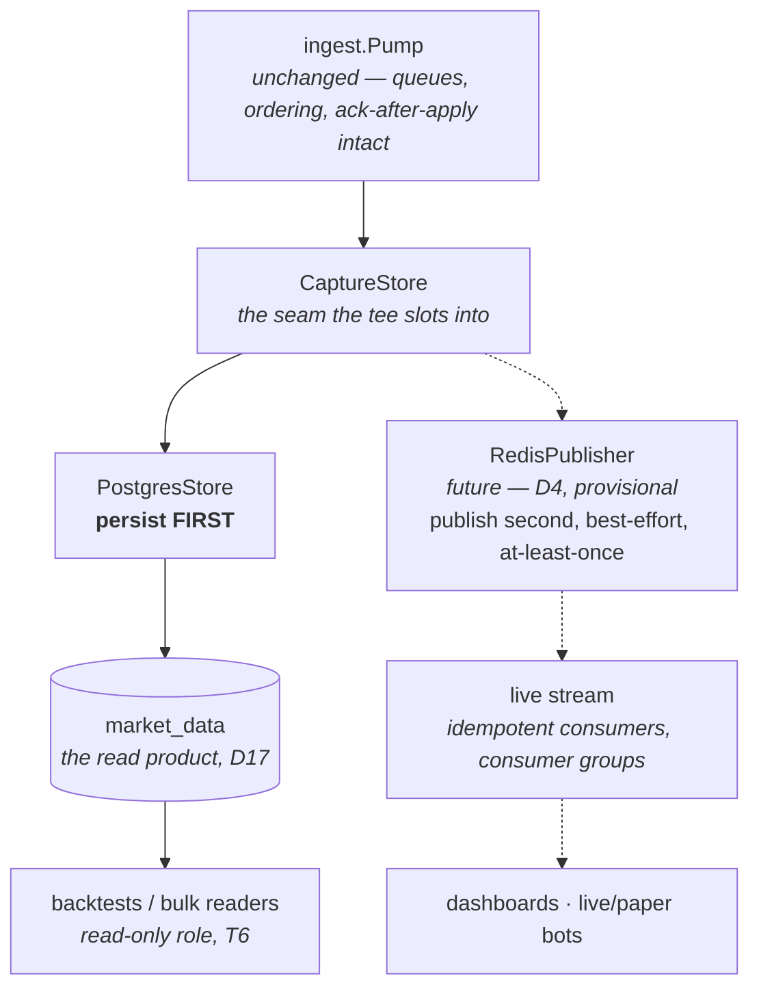

# Chapter 9 — Busses, and serving the data outward

Part of the Tradebench Field Manual. The capture pipeline ends in Postgres — so how do
downstream applications (charts, the backtester, live bots) get the data? This chapter
explains message busses from first principles, why the platform's answer is *mostly not
a bus*, and the fan-out plan recorded in architecture §3.5.

## The jargon

- **Message bus / broker** — infrastructure that accepts events from producers and
  delivers them to consumers, decoupling the two in time and space (Redis Streams,
  Kafka, RabbitMQ).
- **Consumer group** — a named cursor a set of consumers shares; the broker tracks what
  the group has acknowledged, so members can crash and resume.
- **At-least-once / at-most-once / exactly-once** — delivery guarantees. At-least-once
  (ours) means duplicates are possible and consumers must tolerate them; true
  exactly-once across systems is folklore — it is always at-least-once plus idempotency.
- **Idempotent by key** — applying the same event twice leaves the same state, because
  writes are keyed (`ON CONFLICT` upserts, dedupe keys).
- **Tee** — one input duplicated to two outputs, named after the pipe fitting.
- **Replay-then-tail** — catch up from storage to a watermark, then switch to the live
  stream from that point, deduplicating the overlap.

## The concept

A bus and a database answer different questions. A database answers *"what is/was the
state?"* — random access, rich queries, one authoritative copy. A bus answers *"what
just happened?"* — push delivery, low latency, each consumer at its own cursor. The
classic mistake is using one to fake the other: polling a table for changes (a slow,
contended bus) or replaying a broker's log to answer queries (a slow, unindexed
database). A platform with both kinds of consumer wants both shapes — with one source
of truth and a defined order between them.

The broker landscape, honestly, at our scale (~£20/mo, a handful of services, one box):

- **Kafka** — a distributed replicated log; superb at fan-out, retention, and replay;
  operationally the heaviest thing on this list. Wrong until scale demands it.
- **RabbitMQ** — work-queue semantics (a message is consumed *away*); good for task
  distribution, wrong for "several apps each read the same market events".
- **Redis Streams** — an append-only log with consumer groups inside a process we
  already run; at-least-once with explicit acks; retention by trimming. Right-sized.
- **REST polling** — no infrastructure, but latency × load scales with consumer count,
  and "not via REST" was agreed for exactly that reason.

Hence **D4**: Redis Streams by default, contracts explicitly schema'd so a Kafka
migration is mechanical, and re-decide only when service count, retention, or throughput
actually demand a log-structured broker — not before.

## Our code path (and our deliberate non-paths)

The platform serves three consumer shapes (architecture §3.2), only one of which is a
bus:

**1. Readers — the database *is* the product (D17).** The `market_data` database is a
**published, read-only data product**: its schema is a versioned contract (the drift
gate in CI pins it byte-for-byte), and downstream services hold read-only credentials
for bulk reads. A backtest wants the *healed, canonical* record — which only exists
after T6's end-of-day heal — so a streaming path would serve it worse, not better.
Writes remain the collection service's alone: **single-writer discipline**, enforced by
Postgres itself (one database per service; cross-database queries are impossible in
plain Postgres, so "never reach into another service's tables" is engine-enforced).

**2. Live consumers — D4 events, teed at the store seam.** The ingest pipeline
(`ingest.Buffers` → `ingest.Pump` → `store.CaptureStore`) is deliberately *not* the
distribution mechanism — it is the get-it-off-the-socket-durably mechanism,
single-consumer by design. Distribution starts **after** durability, at the
`CaptureStore` seam, as a composite store:

The invariant is **persist-then-publish**: the stream must never advertise an event a
crash could take out of the database, or consumers and the record disagree forever.
Publishing is best-effort and at-least-once; consumers dedupe on the same natural keys
the schema already enforces (`user, source, instrument, ts_utc…`). The honest cost: a
consumer's latency includes the pump's write cadence — ticks batch at 500/flush — fine
for charts and analytics; a consumer ever needing sub-batch latency is a **new
requirement to rule on**, not a silent tee-relocation.

**3. The engine feeder — E3-era.** The backtest/live engine needs one deterministic,
`dataTime`-ordered stream of mixed ticks and bars, so interleaving and tie-breaks are
defined once, identically in replay and live. That contract is the parked event-model
design (the `EventSource` question), settled at the E3 engine session — not by the
capture service.

**Catch-up and "continuous backtest" — replay-then-tail.** A consumer that wants
history *and* now: bulk-read the database up to a watermark, subscribe to the live
stream from it, dedupe the overlap on natural keys. This composes shapes 1 and 2 rather
than inventing a third; it is the standard pattern under every event-sourced system.

## The scars (this time, avoided in advance)

> **Scar** — **One process doing everything** · the prototype's tangle
>
> The prototype's capture, serving, and healing concerns grew entangled in a single process;
> separating them afterwards was expensive — and is part of why Tradebench exists.
>
> **Lesson.** Decouple at deployable-artifact boundaries (P7) and build the bus only when its
> first consumer exists (D4) — but choose the seams (`CaptureStore`, dedupe keys, single-writer)
> up front so fan-out is a compose, not a rewrite.

None of this is built, and that is a decision, not a gap: **P7** (decoupling is a means;
the collection service stands alone) and D4's own re-decision gate say the bus is built
when its *first consumer* exists — infrastructure built speculatively is infrastructure
maintained speculatively. What T5-era code *did* buy now is the shape: the seam the tee
needs (`CaptureStore`), the keys idempotency needs (V1's dedupe constraints), and the
single-writer topology (D17) were all chosen so fan-out is a compose, not a rewrite.
The prototype's version of this chapter was learned the expensive way — its capture,
serving, and healing concerns grew tangled in one process, and separating them later is
part of why Tradebench exists.

When the first live consumer arrives, the order of work is: schema the event contract
(D4 requires it), add the publisher leg behind `CaptureStore`, prove persist-then-publish
under a kill test, and only then let the consumer ship.