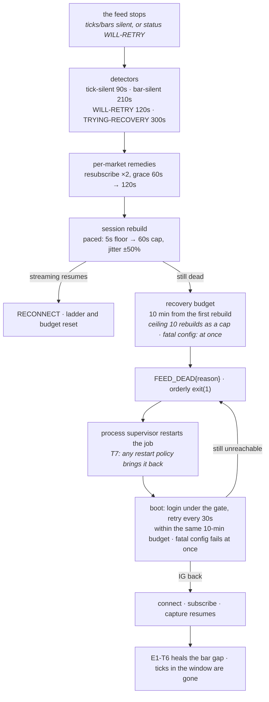
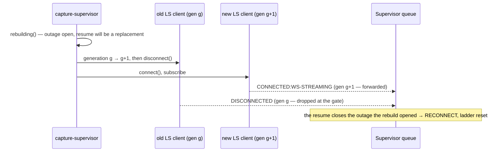

# Chapter 10 — The failure playbook: what breaks, what we do, what it costs

Part of the Tradebench Field Manual. Chapter 8 is the *tour* of the resilience belt — each pure
core, then the `Supervisor` shell that runs them — read bottom-up, class by class. This chapter
is its companion, read top-down: **a failure happens; what does the service do, how long does
it take, what is lost, who finds out, and how does it heal?** It also gathers in one place the
*policy* behind every number in `Tuning.playbook()` and `Main`, with the rulings and their
reasons, so the design can be judged as a whole rather than one constant at a time.

Where this chapter says *pending*, the code is not built yet; where it says *ruled*, the
decision is recorded (the E1 plan's T5 section carries the dated nods and amendments).

## The jargon

- **Fail closed** — when in doubt, do the safe thing. The whole chapter turns on noticing that
  "safe" differs by what is at stake: for irreplaceable data it means *hold the data*; for a
  broken session it means *stop and start clean*. The two are often conflated; here they are
  kept apart on purpose.
- **Fail loud** — a failure is never silent: an event row, a heartbeat counter, a FATAL log line,
  a non-zero exit — something an alarm can key off.
- **Product plane / observability plane** — the data we are paid to keep (ticks, bars) versus
  the data about the service (events, gaps, status). Different planes, different failure rules.
- **Outage** — the span from the feed stopping to streaming resuming, as the classifier sees it.
- **Rung** — one rebuild attempt in the recovery ladder; **budget** — the clock that ends the
  ladder; **give up** — the belt's deliberate stop, as opposed to a crash.
- **Outer loop** — the process supervisor (compose/systemd restart policy) that restarts the
  job after the belt gives up. The belt is the inner loop; it never retries forever.
- **Generation** — a counter identifying *which* connection a Lightstreamer callback belongs to,
  so a superseded connection's late words can be ignored.

## The failure model — one table

Every row is a real failure the service is built to meet. "Cost" is what is lost by design;
"heals" is how the record is repaired afterwards (bars are *healable* from IG's REST history by
the E1-T6 job; ticks are not — a tick missed is gone, P8 notwithstanding, because IG never
re-serves them).

| What breaks | How we notice | What we do | Cost | Who finds out | Heals |
|---|---|---|---|---|---|
| The server stops talking but the socket stays up (*silent while connected*, the 2h56m scar) | `StalenessWatchdog`: no tick for **90s** while the market's `DLG_FLAG` says open; or ticks flowing but no sealed bar for **210s** (a dead CHART leg); no verdict while the connection itself is down — that silence is the escalator's; a market reading CLOSED/SUSPEND for **12h** gets one teaching resubscribe, so a zombie cannot hide behind a weekend (D29) | per-market **resubscribe** ×2 (T+90s, then T+210s — the grace doubles before each wait: 120s, 240s), then a session **rebuild** (T+450s); ≥2 markets stale together (within one sweep of each other) → rebuild at once | ticks from the stop to the resume; a bar gap | `WATCHDOG_STALE` events; `RECONNECT{replayed=false}` on resume; `BAR_GAP` | heal backfills the bars |
| The SDK hangs in `DISCONNECTED:WILL-RETRY` (it gave up without saying so) | `StuckSubstateEscalator`: **120s** in WILL-RETRY, **300s** in TRYING-RECOVERY (the server may still replay there) | **rebuild**, paced by backoff | as above | `STUCK_SUBSTATE_ESCALATED` | heal |
| The client gives up for good — a bare `DISCONNECTED` (the server's refusal follows it as `onServerError`) | `ReconnectClassifier.isTerminal`: exactly `DISCONNECTED`, never the two retry substates | **rebuild now**, paced by backoff, the budget starts — no substate will ever escalate this, and the watchdog stands down on closed markets | the outage | `CONNECTION_DEAD{status | code, message}` + `IG_API_ERROR{code, message}` (both set one latch: one death, one rebuild — asked again every sweep until the pacing lets it run) | heal |
| A normal drop and reconnect | `ReconnectClassifier` on any streaming substate | nothing — report | none if the server replayed (no WILL-RETRY seen); otherwise the outage's data | `RECONNECT{replayed, wallOutage, awakeOutage, hostSlept}` | heal when `replayed=false` |
| One market's subscription is rejected three attempts running (a pair's two legs are one strike) while another market's pair is confirmed — a verdict due while that witness is still inside its 30s confirm window waits, and is rendered the moment it confirms or the window lapses | `WitnessQuarantine` (§3.5) | **quarantine** that market — unsubscribe its pair, leave it off, and ignore its later rejections (the pair's other leg, a late one — never re-admitted, never re-subscribed); exit is restart-only | that market until the next restart | `MARKET_QUARANTINED` | restart |
| The same, but no healthy witness | `WitnessQuarantine` | treat as session-shaped: **rebuild** | the outage | `SUBSCRIPTION_REJECTED` | heal |
| The host is suspended and resumes — a paused or migrated VM, a hibernated instance | wall clock jumped, monotonic did not (`hostSleepSkew` 5s) | **re-baseline**, no alarm; annotate the resume | none that we can act on | `RECONNECT{hostSlept=true}` | — |
| The WebSocket silently downgrades to HTTP polling | `noteFor(CONNECTED:HTTP-POLLING)` | report only | latency | `TRANSPORT_DOWNGRADED` | — |
| Recovery keeps failing | the **budget**: 10 min from an outage's first rebuild without streaming resuming (ceiling: ten rebuilds that connected, as a cap — a rebuild that could not connect is asked for again, paced, until the clock runs out) | **give up**: `FEED_DEAD`, orderly `exit(1)`; the outer loop restarts us | the whole outage until IG returns | `FEED_DEAD{reason=budget|ceiling}`, exit code 1, restart counter | heal |
| IG rejects the configuration itself (key, account, **wrong password**) | `IgFatalConfigException` — the §1.6 taxonomy's fatal families, now including `error.security.invalid-details` | **stop at once** — never climb a ladder against a lockout; at boot, fail before retrying | everything until a human fixes config | `FEED_DEAD{reason=fatal_config}` or a FATAL boot line, exit 1 | human |
| IG unreachable at boot (we restarted into an outage) | login fails with a retryable error | **retry every 30s under the login gate, for the same 10-min budget**, then exit 1; any other exception at boot fails loud at once (exit 1 with its trace) | the outage | "boot attempt N" lines, then FATAL | heal |
| IG enforces a smaller REST budget than it publishes (demo keys: 10/min, not 30) | `GET /operations/application` after login | start at 10/min, then apply min(`allowanceAccountOverall`, `allowanceApplicationOverall`) minus 5 headroom (≥1); an unlisted key or a failed read keeps the start | nothing — the pacer paces every REST caller | `PACER_DISCOVERED{account, application, published, used, headroom}`, or an `IG_API_ERROR` naming the read plus a "keeping the conservative start" line | — |
| Postgres blips while we write an **event/gap/status** row | `PersistenceException` from the observability store | **count and continue** — the belt and the pump never die for a breadcrumb | the breadcrumbs written during the blip | `obsFailures=` / `eventWriteFailures=` / `statusFailures=` in the heartbeat | coverage truth is recomputed from `bars_1m` |
| Postgres blips while we write a **tick or bar** | a `PersistenceException` the taxonomy calls **retryable** (SQLSTATE 08 / 57 / 53 / 40, or the pool's timeout) | **hold**: bars stay queued, the store keeps its tick batch; back off 5s → 60s; `recover()` re-acquires a pooled connection and re-binds the held ticks; resume. No time budget — the queues bound the hold (ticks shed-oldest at 100 000 ≈ 18 h; bars unbounded) and the moment shedding starts is announced | nothing while the hold is lossless; ticks once the queue sheds | `sinkFailures=` in the heartbeat, the log's narration, `SINK_FAILURE{cause, outageMs, attempts, ticksShed, queuedAtRecovery}` once the episode is proven over — the recovery landing the held batch, or the first write after it; the dead-man alarm (stale `capture_status`) fires meanwhile, correctly | — (nothing to heal while lossless) |
| Postgres rejects a tick/bar write for a reason that is **not weather** (integrity, schema, authorisation, data, an unknown or missing state) | `PersistenceException.retryable() == false` | **stop at once**: the pump dies, a best-effort `DB_ERROR{cause, queued}` is written, `onDeath` logs the cause, `exit(1)` now — not a heartbeat later | whatever was held | `DB_ERROR` + a FATAL line with the cause, exit 1 | human |
| The pump or the supervisor thread dies for any other reason | `Main`'s heartbeat: `!thread.isAlive()` | exit 1 | until restart | FATAL line | heal |

## The principles — eight rules and the reason for each

1. **Decisions run on in-memory state; the database is downstream, never upstream.** No remedy
   waits on a query, so a database problem can never stall a recovery decision.
2. **Fail closed means *hold the data* for the product plane and *stop clean* for a session.**
   Bars are removed from their queue only after the write returns (ack-after-apply); a broken
   session is torn down and rebuilt, never patched. These are different reflexes and the
   chapter never lets one masquerade as the other.
3. **Observability is best-effort, counted, never fatal.** A failing event, gap or status write
   is counted and surfaced by the heartbeat; it is never allowed to kill the thread that
   decides. The alternative — a healthy capture process exiting because an audit row could not
   be written — inverts the priorities, and was exactly the hole the step-6 review found.
4. **Decide; don't wait to be told.** When the Supervisor *causes* a state change (tearing a
   connection down), it records that itself, synchronously, on its own thread. It never relies
   on the superseded connection reporting its own death — that report may be late, or never
   come. (The generation gate makes the stale report impossible; `rebuilding()` supplies the
   fact we already know.)
5. **Everything is bounded by a clock, not a count.** Rebuild attempts have cadences set by
   detectors that vary tenfold between failure modes, so "ten attempts" meant anything from
   twenty minutes to half a day. The budget is a clock: ten minutes from the first rebuild.
   Boot retry has the same budget. The error taxonomy's own rule — *callers must never loop on
   RETRYABLE unbounded* — holds at both ends.
6. **Restart is cheap; use it.** A JVM restart during an IG outage costs nothing (the feed is
   already dead; the pump drains to the sink on shutdown) and is the only cure for the rare
   wedged-process case. So the belt errs *short* and hands over to the outer loop. `exit(1)`
   rather than `0` because the mission failed and because 1 restarts under every restart policy
   (`always`, `unless-stopped`, `on-failure`), so no deploy choice becomes load-bearing.
7. **Cheap work only on the socket's thread.** Lightstreamer callbacks stamp a clock and enqueue;
   everything else runs on the pump or the supervisor thread. Backpressure never reaches the
   socket (chapter 2, chapter 3).
8. **One process per job.** The isolation boundary for multi-user capture (B1) is the process:
   a dead feed, a give-up or a config error in one job can never touch another, because the
   remedy of last resort is `System.exit`.

## The clocks, and how they interact

Every number, where it lives, and what it means:

| Number | Where | Meaning |
|---|---|---|
| 90s / 210s | `Tuning.tickSilent` / `barSilentWhileTicksFlow` | a quiet-but-open market is dead / a dead CHART leg while PRICE lives |
| 120s / 300s | `willRetryRebuild` / `tryingRecoveryRebuild` | how long a stuck substate is tolerated — less for the one where the server has given up |
| 60s → 30 min | `watchdogGraceBase` / `watchdogGraceCap`, `watchdogMaxResubscribes` 2 | per-market remedy episodes: doubling grace so a genuinely quiet market decays to one remedy per half hour |
| 5s floor, 1s·2ⁿ, 60s cap | `rebuildFloor` / `backoffBase` / `backoffCap` | rebuild pacing — the floor is IG's login cache lesson (§3.2); the cap keeps the ladder responsive |
| **10 min** | `giveUpAfter` | the recovery budget — the number an operator can actually reason about |
| 10 | `maxConsecutiveFailures` | belt-and-braces cap behind the budget — rebuilds that connected, never failed attempts |
| 3 / 30s | `subscriptionStrikes` / `subscribeConfirmWindow` | the witness rule's strikes and confirm window (§3.5) |
| 12h | `standDownTeach` | the CLOSED/SUSPEND stand-down's bound: one teaching resubscribe per period (D29 (1)) |
| 5s / 10s | `hostSleepSkew` / `processFreezeJump` | the clock-divergence discriminators (chapter 7) |
| 1s | `Main.SWEEP_INTERVAL` | the supervisor's cadence — the detectors assume it |
| 30s / 10 min | `Main.BOOT_RETRY` / the same `giveUpAfter` | boot retry spacing and budget |
| 60s | `Main.HEARTBEAT` | the `capture_status` cadence, and the backstop for a dead supervisor thread (a dead pump is reported by `onDeath` at once); a Postgres outage adds at most the pool's 5s timeout per heartbeat — every market's row on one pooled connection (E1-T10 #22) |
| 5s floor → 60s cap | the belt's `BackoffPolicy`, via `Pump` | the sink's retry pacing during a hold — the floor also clears HikariCP's 500ms alive-bypass window, so the second attempt gets a validated connection |
| 5s | `Database.CONNECTION_TIMEOUT` | how long a Tier-2 write or a sink recovery waits for a pooled connection while Postgres is down — the heartbeat's worst case per publish, one connection for every market's row (E1-T10 #22) |
| 250ms | `Pump.HOLD_SLICE` | how quickly a hold notices `stop()` |
| 61s | `LoginRateGate.MIN_INTERVAL` | spacing between logins — IG caches login responses, so faster re-logins get stale tokens |
| 10/min → published − 5 | `RequestPacer.CONSERVATIVE_START` → `PacerDiscovery.HEADROOM` | the REST budget: a conservative start, then the tighter of the account's and the key's real allowance (never the published constant — demo enforces 10/min) minus headroom for T6's heal, which spends the same key |
| *deploy* | restart policy + delay (T7, pending) | the outer loop's cadence; see the ruling below |

**A worked timeline — the server goes silent at T+0, one market open, IG down for twenty
minutes.** T+90s the watchdog fires: `WATCHDOG_STALE`, resubscribe DAX; the market's grace
doubles to 120s. T+210s still silent: second resubscribe; grace 240s. T+450s resubscribes
exhausted: **rebuild #1** — `rebuilding()` opens the outage and starts the budget clock; the old
connection is torn down (its generation retired), the session is validated-or-renewed, a new
connection is opened. IG is down, so the new client reports `DISCONNECTED:WILL-RETRY`; T+570s
the escalator forces **rebuild #2**, and so on at roughly two-minute rungs, each paced by
backoff. At **T+1050s** — ten minutes after rebuild #1 — the budget expires:
`FEED_DEAD{reason=budget}`, orderly `exit(1)`. The outer loop restarts the job; boot logs in
under the gate, fails, retries every 30s. When IG returns at T+20min the boot succeeds,
capture resumes, and E1-T6 later heals the bar gap from T+0. Twenty minutes of ticks are gone;
every bar comes back.

**The same outage, five seconds long.** T+5s ticks resume; nothing fired. Had the drop shown
as a status change, the classifier reports one `RECONNECT{replayed=true}` — the server
replayed, no gap, nothing owed.

## Threads and hand-offs

Five threads touch the belt. Knowing which owns what is most of what there is to know.

| Thread | Owns | Allowed to do |
|---|---|---|
| Lightstreamer callback threads | nothing of ours | stamp a clock, enqueue — and that is all |
| `capture-supervisor` (the sweep) | the cores, `watched`, `IgStreamControl`'s handles | everything decided and executed |
| `capture-pump` | the sink, the gap detector | write market data; derive gaps and state events; hold and retry through a sink outage (E1-T9) |
| `capture-events` (the Tier-2 writer) | the event queue | hand the sweep's queued service events to Postgres, off the sweep thread (D29 (3)); a refused write is counted and dropped, never retried, never blocking a sweep |
| main (heartbeat) | the health probe | watch the sweep and the pump live; exit 1 if one dies; publish `capture_status` through the shared pool — a Postgres outage holds it at most 5s per heartbeat, every market's row on one pooled connection (`Database.CONNECTION_TIMEOUT`, E1-T10 #22); a dead pump is reported by `onDeath` at once, so this check is the backstop |

Three fences make the hand-offs safe. **Queue** — what a callback wrote before `add()` is visible
to the sweep after `poll()`; the pump has the same contract with `Buffers`. **`Thread.start()`**
— everything `start()` and `watch()` wrote before the supervisor thread was started is visible
to it, so boot needs no locks. **`join()`** — on shutdown the hook stops the sweep thread and
*waits for it* — up to five seconds — before closing the stream, exactly as it stops, joins and
only then closes the pump's sink; closing underneath a thread that is mid-rebuild would be two
threads in one `HashMap` (the step-6 review's F3). Past the five seconds it closes anyway: the
interrupt has broken the login gate and the HTTP waits by then, so the bound is a backstop, not a
race. The hook is registered before boot, so a SIGTERM during a slow start still closes the
stream and the sink (E1-T10 #24). The event writer is stopped last and its queue drained by the
hook, so the sweep's last words land.

**The one race that no fence covers — and the gate that closes it.** A rebuild tears one
Lightstreamer client down and starts another. Each is an independent state machine on its own
threads, and their callbacks are *notifications*, dispatched later: `disconnect()` returns at
once and the `DISCONNECTED` arrives whenever that client's teardown completes. Nothing orders
the old client's farewell against the new client's greeting — and the old client is the one
holding a *zombie* socket, the slowest to tear down, exactly when a healthy new connection comes
up fastest.

Without the gate, `[STREAMING(new), DISCONNECTED(old)]` meant: no outage open when the resume
arrived → no `RECONNECT` → the budget kept running → a *healthy* feed exited ten minutes later;
then the late farewell opened a phantom outage nothing would close; and a torn-down leg's
`onSubscriptionError` could strike a healthy market in the new session. Two mechanisms, each
necessary: the **generation gate** drops anything a superseded connection says (no phantoms,
whatever the order), and **`rebuilding()`** supplies the fact the Supervisor already knows (the
outage is open; the resume is a replacement), so the reset is driven by our decision, not by a
report from the thing we just killed.

## When the database fails

Three kinds of write, three answers — decided by *what the write protects*:

| Tier | Writes | Policy | Why |
|---|---|---|---|
| 1 — the product | ticks, bars (`PostgresStore`, pump thread, one pooled connection kept for the store's life — swapped by `recover()` after a blip) | **fail closed, by holding**: a retryable failure keeps bars queued and the tick batch held, backs off 5s → 60s, recovers the connection, resumes — no time budget; anything not known-transient stops the pump and the process exits 1 at once | irreplaceable data must never be silently dropped — and a restart would drop exactly what the hold protects; a broken sink must never be written into, so only a *recovered* one is |
| 2 — observability | events (queued; one writer thread hands them on — D29 (3)), gaps, status (observability store, a pooled connection per write) | **best-effort, counted, continue** | breadcrumbs; the store self-heals on the next write; coverage truth is recomputed from `bars_1m` |
| 3 — decisions | none | never touch the DB | principle 1 |

**The Tier-1 ruling (2026-10-04, E1-T9).** Stop-and-restart was *a* fail-closed answer but a
crude one: a five-second Postgres blip cost a minute or two of ticks we were holding perfectly
well in memory. The landed answer is **hold and retry**, and it has **no time budget** —
deliberately. The data is already safe while we hold: bars stay queued (ack-after-apply) and
`PostgresStore` keeps its own copy of the pending tick batch, added before anything about a write
can fail and acknowledged only once `executeBatch` returns, so a connection that dies mid-batch
loses nothing; `recover()` re-acquires a pooled connection, re-prepares, re-binds the held ticks and
executes the batch — recovered means a write landed (E1-T10 #6) — and only then discards the dead
objects; a recovery that fails changes nothing. Until `recover()`
runs, the store **refuses** every write and flush: the driver drops its batch on a failed
`executeBatch`, so a retry on the same statement would send nothing and acknowledge everything (the
ticket's review found exactly that path in the shutdown tail drain). A restart would
gain nothing against a database outage and would lose everything held, the opposite of P8; the
belt's `exit(1)` is about the JVM or the stream possibly being the fault, and a retry loop that
fails only on the database proves the JVM is fine. What bounds the hold is the queues: bars are
unbounded (and tiny — one a minute per market), ticks shed-oldest at 100 000 (about eighteen
hours of DAX), and the moment shedding starts the pump says so (`the hold is now lossy`). What
makes it loud: `sinkFailures=` on the heartbeat line, the log's narration, one
`SINK_FAILURE{cause, outageMs, attempts, ticksShed, queuedAtRecovery}` dated from the first failure and
written once the database is back (nothing is attempted while it is down — it would fail and count
as noise), and the dead-man alarm — `capture_status` goes stale too — firing in the console
meanwhile, correctly. What counts as a blip is the **taxonomy** on
`PersistenceException.retryable()`: known-transient only — SQLSTATE classes 08 (connection), 57
(operator intervention: a shutdown, a crash), 53 (insufficient resources), 40 (transaction
rollback), plus the pool's own connection timeout; the first state in the cause chain decides.
One consequence to know: through the pool, a rotated password surfaces as the pool's timeout wrapping
`28P01`, so a bad password at recovery **holds forever, loudly** rather than exiting — the pool
timeout is retryable whatever it wraps, and holding loses nothing where an exit would lose everything
held (P8); the dead-man alarm says so meanwhile.
Everything else — 23 integrity, 42 syntax, 28 authorisation, 22 data, an unknown or missing
state — is terminal: the pump dies, `onDeath` logs the cause and exits 1 *now*, not a heartbeat
later (never on a deliberate stop, where an exit from inside the shutdown hook would deadlock).
The retry pacing is the belt's own `BackoffPolicy` — 5s floor, doubling, 60s cap — and the floor
earns its keep twice: it spaces reconnects, and it clears HikariCP's 500ms alive-bypass window,
inside which the pool hands a just-returned dead connection out unvalidated (the Testcontainers
tests had to evict the pool by hand to see what backoff gives production for free). The shared
pool's `connectionTimeout` is **5s** (`Database.CONNECTION_TIMEOUT`): a Tier-2 write or a sink
recovery waits at most that long while Postgres is down, so the heartbeat's worst case is 5s per
market and `recover()` fails fast into the backoff instead of hanging. All six choices were ruled
on 2026-10-04 and are logged as **D28**. **Proven in anger on 2026-10-05:** a 152-second
`docker stop` of the dev Postgres mid-capture — the failure fired on the idle flush, seven retries at
5 / 5 / 5 / 11 / 13 / 43 / 39 s, `sink recovered after 152s and 7 attempt(s); 303 queued writes to
drain`, every minute's bars and ticks present afterwards, one `sink_failure` row, no `bar_gaps` row.
The drill routine, the log and the verification queries live in the E1 plan (T9 §).

## Giving up, loudly

Recovery ends in exactly three ways, and `FEED_DEAD.detail.reason` names which: **`budget`**
(ten minutes without streaming since the outage's first rebuild), **`ceiling`** (ten rebuilds,
the cap), **`fatal_config`** (IG rejected the configuration mid-ladder — stop now, never hammer
a lockout). Give-up latches: one event, sweeping stops, `onExhausted` runs once — in `Main`,
a FATAL line and `System.exit(1)`.

What the operator sees, in order: `WATCHDOG_STALE` / `STUCK_SUBSTATE_ESCALATED` /
`CONNECTION_DEAD` / `SUBSCRIPTION_REJECTED` reason events as rebuilds happen; `RECONNECT` with `replayed` saying
whether a heal is owed; `FEED_DEAD{reason}`; the exit code; the heartbeat line's counters
(`dropped`, `malformed`, `sinkFailures`, `obsFailures`, `eventsQueued`, `eventWriteFailures`, `statusFailures`) every minute until then. Two alarms
are distinct and must stay so (the probe writes them — step 4; reading them is E9's): **box down** — `capture_status.updated_at`
stale, nothing is running; **feed dead** — the process is up and heartbeating but
`last_tick_at` is stale **while `market_state` says the market is open** (a `CLOSED` market is
quiet by the watchdog's own rule — never alarm on it), or `stream_state` is not
`connected_streaming`, or `FEED_DEAD` was written. `stream_state = window_closed` is not produced
until R4's stream windows exist. A restarting job keeps the first fresh while
the second fires; conflating them would hide an outage behind a healthy-looking heartbeat.

The **outer loop contract** (T7, pending): the restart policy must restart on exit 1 with a
delay of its own; the belt's boot budget means a restart into an ongoing outage costs one
paced login every 30s for ten minutes, then another exit — a slow, visible loop that respects
IG's login cache and never parks the service.

## Multi-job: why the process is the isolation boundary

The belt is entirely per-instance state — nothing static, nothing shared — so one `Supervisor`
+ `IgStreamControl` + `Buffers` + `Pump` per connection is the natural unit, and three jobs
(your live key, your demo key, a brother's own key) are three independent sessions with three
rate budgets. But the remedies of last resort are `System.exit`, so jobs must be **processes**,
never threads in one JVM: a give-up in one must not take the others down. The two things B1
must change are the single-instance advisory lock (per job, not per service) and the hardcoded
user; nothing in the belt, the pump or the schema. See `backlog.md` B1.

## The rulings behind it

The cross-cutting ones — the DB-write tiers, exhaustion as a time budget with `exit(1)`, the one
streaming rule — are logged as **D27** (`docs/decisions.md`); the dated lines below are the
in-ticket record.

- **2026-09-28 (E1 plan nod):** witness quarantine built now; exhaustion = clean exit(0) with the
  container restart policy as the outer loop; all §8 timings in one `Tuning` record.
- **2026-10-03 — slice C step 3:** observability writes in the pump are best-effort-but-loud;
  the sink stays fail-closed.
- **2026-10-03 — step 6:** the Supervisor ↔ `StreamControl` cycle is tied off by one `bind()`
  at the composition root; remedies are total (never throw); the Supervisor runs in both sink
  modes; sweep cadence 1s.
- **2026-10-03 — exhaustion re-ruled:** a **time budget** (10 min) rather than a count; **`exit(1)`**
  rather than 0; boot retries retryable errors under the gate within the same budget and fails
  loud on a rejected configuration; a rejected configuration mid-ladder stops recovery at once;
  `error.security.invalid-details` classified fatal.
- **2026-10-03 — step-6 review:** the belt's own event writes made best-effort (F1); boot bounded
  (F2); shutdown joins the sweep thread before closing (F3); the generation gate and
  `rebuilding()` (F5).
- **2026-10-03 — step 4:** the heartbeat publishes `capture_status` through `HealthProbe` (per-market
  telemetry from `Buffers`, stream state and reconnects from the Supervisor's `BeltView`);
  `last_bar_at_utc` is the bar's start; dropped ticks are charged to the shed tick's market;
  `db_pending` is bars + ticks queued; every market's row goes in one batch on one connection, and a
  failing publish is counted once, never thrown (E1-T10 #22). **Ruled the same
  day:** the view and `ReconnectClassifier` share one rule — any `CONNECTED:*` substate except the
  `STREAM-SENSING` handshake is streaming, so a resume onto a polling fallback ends the outage and
  resets the ladder (the degradation itself is `TRANSPORT_DOWNGRADED`); the two voices cannot
  disagree about what "resumed" means.
- **2026-10-03 — step 5:** the REST pacer starts at 10/min and is set after login from
  `GET /operations/application`: min(`allowanceAccountOverall`, `allowanceApplicationOverall`) − 5
  headroom, at least 1 — the account figure is shared by every key on the account (a demo and a
  live key both draw on it), so whichever is tighter is the one IG enforces first (ruled
  2026-10-03, Alex) — recorded as `PACER_DISCOVERED{account, application, published, used,
  headroom}`; an unlisted key or a failed read keeps the start
  and says so — an `IG_API_ERROR` and a log line (never a stand-in from another key); an entry
  without a usable figure is refused at the boundary, never laundered into a 1/min budget.
- **2026-10-04 — E1-T9:** Tier 1 refined to hold-and-retry with **no time budget** (the queues
  bound it; shedding is announced); the blip taxonomy on `PersistenceException.retryable()`
  (SQLSTATE 08 / 57 / 53 / 40 + the pool timeout retry; all else terminal, at once); the belt's
  `BackoffPolicy` reused for the sink; one `SINK_FAILURE` on recovery; `onDeath` → immediate
  `exit(1)` (never on a stop); the pool's `connectionTimeout` 5s. Logged as **D28**.
- **Pending:** the T7 restart-policy contract; B1 multi-job.

## Where this chapter is tested

The table above is executable. The belt's scenario harness (E1-T11) lives in
`market-data-service/src/test/java/dev/amfshr/tradebench/marketdata/scenario/`: `ScenarioRunner`
drives the production composition — `CaptureAssembly`, the same wiring `Main` boots — through a
scripted timeline with no threads and no real waiting. Time is a fake clock's and passes only when
the pump sleeps; each time it moves, the events now due go onto a fake wire, then every sweep that
fell due runs, then every heartbeat — chapter 2's callback-thread / sweep-thread hand-off, in one
deterministic order. A scenario asserts on **five observables** and nothing else: the remedies
issued on the wire (connect, disconnect, subscribe, unsubscribe — with their offsets), the events
recorded, the sink writes landed, the heartbeat's rows, and how the run ended. The expected numbers
are this chapter's, each derived in a comment beside its assertion, so policy drift is a failing
test.

`BeltScenariosTest` holds two kinds of scenario. Policy scenarios are written in a small Java DSL
(`Scenario.named(…).markets(…).at(offset, events…)`) with every answer IG gives scripted. Replays
are captured outages loaded from JSONL (`Replays.load`; the format and the two exporters — the
prototype's `igtrader` tables and our own `ticks`/`bars_1m` — in
`market-data-service/src/test/resources/replays/`). The 2026-08-04 scar is the first replay, and
the heartbeat reading `CONNECTED_STREAMING` through the first minute of its silence is the scar,
asserted. A scenario for a promise the code does not yet keep is written to this chapter and
marked `@Disabled("E1-T10 <slice> — finding #n")`; its fix enables it as the exposing test. The
full captured-outage library, and the same replays through the real `Pump` and `PostgresStore`,
are E1-T12.

## The scars this chapter answers

Silent-while-connected (2h56m) → the watchdog's worldview and the escalator. The remedy storm →
episodes, grace, pacing. IG's login cache → the backoff floor and the login gate. "0.4s offline"
→ dual-duration reporting and host-sleep immunity. A review's eye → the belt dying for a
breadcrumb, an unbounded login loop, a shutdown that didn't wait, a farewell that could arrive
after the greeting. A five-second blip that cost minutes → the sink that holds. None of these are hypothetical; that is why the numbers live in code under
version control and the reasons live here.
